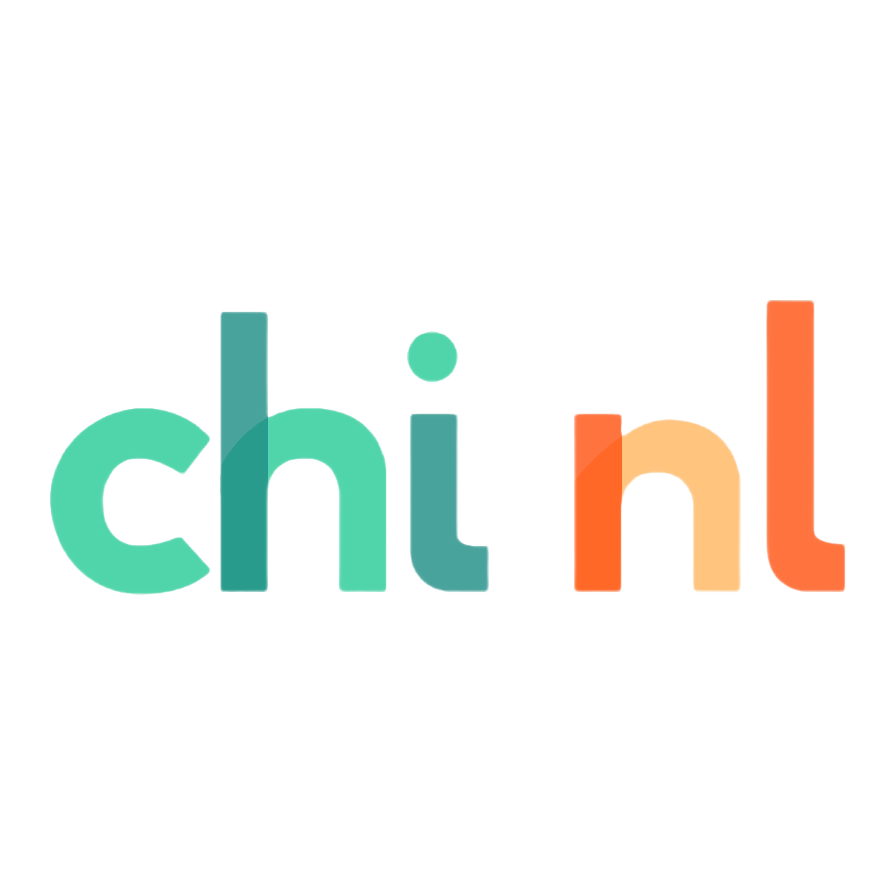

The Dutch Post-CHI event will take place in hybrid format on (tenatively) **June 2, 2022**, from 09:00-17:00 CEST, with a follow-up evening program TBD.

## What is this Dutch Post-CHI event?

Following the global spirit of meeting fellow HCI folks within a local region, this year CHI NL aims at bringing the HCI community in the Netherlands together after CHI 2022. The goal is to provide an opportunity for researchers to present and discuss their accepted CHI 2022 works in a smaller and cozier manner than what the enormity and madness of the CHI ship allows. We are currently still developing the program, but this will include:

1. CHI 2022 submission presentations
2. HCI outreach talks (on topics related to CHI Netherlands, trends within CHI, industry focus, etc.)
3. Informal social chat and networking + borrel :)

Join us for a full day event of exciting CHI 2022 talks, networking, and collective reflection with fellow HCI researchers in the Netherlands. Everyone from students to professors to industry practitioners to artists is welcome.

## How to participate

Anyone is free to attend, without being required to submit or present anything. If you wish to present, your presentation(s) can be informal, and we won't ask you to invest any extra effort on top of what you have already done for the CHI conference. Feel free to re-use existing slides or a poster, or just free-form talk about your work and answer questions.

If you would like to participate as a presenter (CHI work: paper, LBW, demo, case study; HCI Outreach) or attendee, please fill the form to register by clicking the link below.

<!-- Please register to help us organize an exciting (and fun) post-chi event! -->

[REGISTER](https://forms.gle/4muCZxcwHSfi37Cq7){: .btn .btn--warning}{:target="\_blank"}

## Organization

**Ujwal Gadiraju** - TU Delft  
**Lisa Koeman** - Elsevier  
**Himanshu Verma** - TU Delft  
**Abdallah El Ali** - CWI

## Contact

For any additional questions, please contact the EventCHI NL team ([event[dot]chinl[at]gmail[dot]com](mailto:event.chinl@gmail.com)).

